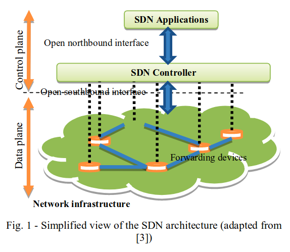
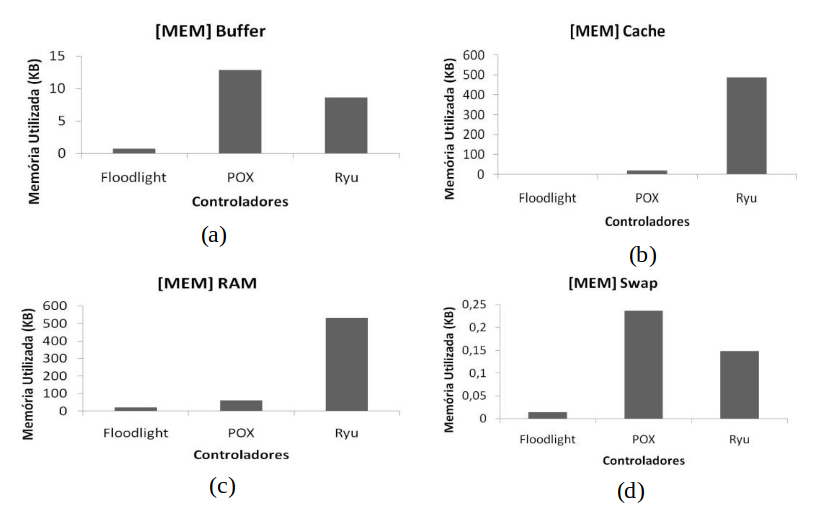
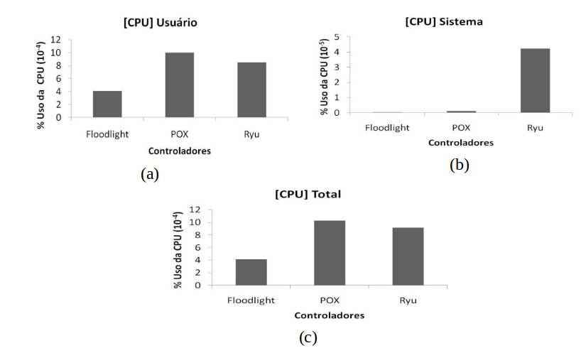

# Controladores SDN

O intuito dessa aula é apresentar alguns dos Controladores SDN existentes.

Serão apresentados alguns Controladores, demonstrando suas peculiaridades.

Após a análise teórica, iremos testar 2 controladores escritos em Python:

- [POX](https://github.com/noxrepo/pox)
- [Ryu](https://github.com/osrg/ryu)

> Antes de começarmos, baixem em suas máquinas os projetos do POX e do Ryu.

Esta apresentação tem como base o artigo
["A comparison between several Software Defined Networking controllers"](https://ieeexplore.ieee.org/document/7357774/) e a dissertação [Estudo comparativo de controladores SDN: avaliando a utilização de recursos no hospedeiro](https://repositorio.ufpe.br/bitstream/123456789/16782/1/DISSERTA%c3%87%c3%83O%20Igor%20Marcel%20Leal%20de%20Morais.pdf).

## Referêncial Teórico

As **Redes Definidas por Software** se baseam em 4 pilares:

1. A separação do **Plano de Dados** e **Plano de Controle**
2. A utilização de **fluxos** ao invés de endereço de destino para decisão de encaminhamento
3. O controle lógico se estabelece em uma entidade externa: o **Controlador SDN**
4. A **programação** da rede por softwares

## Controladores

<!-- POX, Ryu, ONOS, OpenDaylight -->

> The  first  SDN  controller  that supported OpenFlow  was  NOX written in C++
>
> Alguns dos controladores mais utilizados do mercado são: Beacon, Floodlight, NOX, **POX**, **Opendaylight** e **Ryu**.

### POX

1. Código aberto
2. Variação do antigo controlador NOX
3. Escrito em Python
4. Sua utilização permite um rápido desenvolvimento do plano de controle, principalmente por usar uma linguagem de alto nível para configuração, ou seja, é mais adequado para casos em que se deseja uma rápida prototipagem do que para usos empresariais
5. Consegue operar em todos os tipos de máquinas e provê uma forma de migração das aplicações baseadas em NOX
6. Enfoque primário na área de pesquisa
7. Suporta diversos sistemas operacionais
8. Suporta a versão 1.0 do OpenFlow

### Ryu

1. Código aberto
2. Escrito em Python
3. Possui suporte de um grupo de pesquisa denominado NTT Labs
4. Com uma API bem definida, torna fácil o desenvolvimento de novas aplicações de gerenciamento e controle
5. Cada aplicação Ryu tem uma pilha para receber os eventos, que são processados na ordem em que são recebidos
6. Assim como o POX, não apresenta escalabilidade no uso da CPU
7. Suporta as versões 1.0, 1.2, 1.3, 1.4 e 1.5 do OpenFlow

### ONOS (Open Network Operating System)

1. Código aberto
2. Escrito em Java, logo necessita de um tempo maior para aprender a utilizar este controlador
3. Pronto para ser utilizado em produção
4. Boa performance
5. Suporta as versões 1.0 e 1.3 do OpenFlow

### OpenDaylight

1. Código aberto
2. Escrito em Java, logo necessita de um tempo maior para aprender a utilizar este controlador
3. Bastante apoiado pela industria de redes
4. Bom para ser utilizado em produção
5. Boa performance e suporte
6. Suporta as versões 1.0 e 1.3 do OpenFlow

## Comparação

### Artigo

Teste de Ping

Controlador | RTT Min [ms] | RTT Max [ms] | RTT Med [ms]
:-- | :-: | :-: | :-:
POX | 0.29 | 103.23 | 20.76
**Ryu** | **0.11** | **61.05** | **11.86**
ONOS | 0.14 | 177.92 | 21.71
Odl | 0.17 | 156.24- | 22.65-

Teste de banda

Controlador | Banda (h1 -> h16) | Banda (h16 -> h1)
:-- | :-: | :-:
POX | 3.93 Gbps | 3.93 Gbps
Ryu | 8.39 Gbps | 8.40 Gbps
**ONOS** | **9.23 Gbps** | **9.23 Gbps**
Odl | 8.64 Gbps | 8.64 Gbps

### Dissertação

| Controlador | Openflow | Fluxos / s |
:-- | :-: | --:
POX | 1.0 | 6.675,51
Ryu | 1.0 | 10.636,40

Controlador | Memória | CPU
:-- | :-: | :-:
POX | Médio | Alto
Ryu | Alto | Alto

## Trabalho Prático

[Tutorial POX 1](https://github.com/mininet/openflow-tutorial/wiki/Create-a-Learning-Switch), [T POX 2](pld.cs.luc.edu/courses/netmgmt/sum17/notes/mininet_and_pox.html)
 e [Tutorial Ryu](https://github.com/osrg/ryu/wiki/OpenFlow_Tutorial)

    dpctl dump-flows
    sudo mn -c
